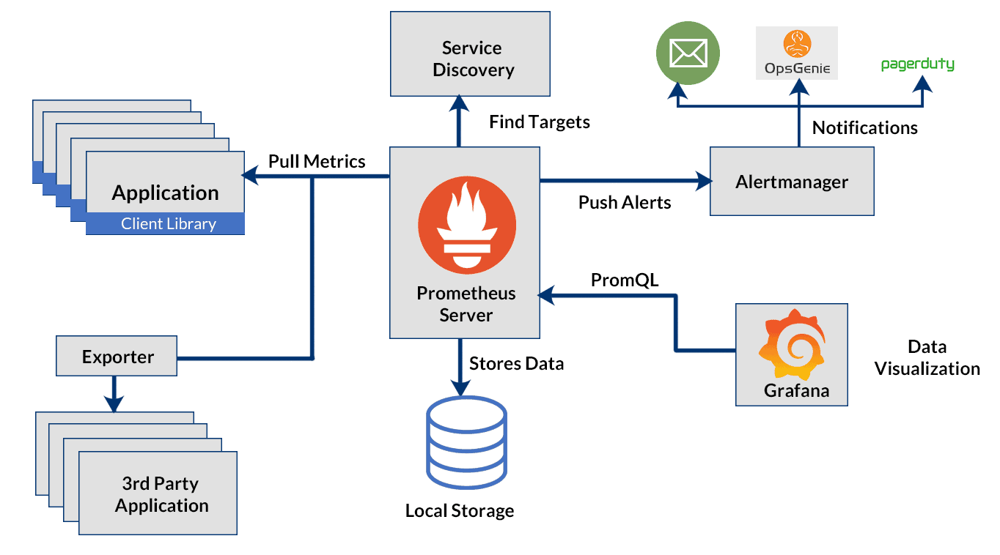

# Prometheus and Grafana Setup with Docker Compose



This repository provides a Docker Compose setup to run Prometheus, Grafana, and Node Exporter. These services are used for monitoring and visualization of metrics.


## Requirements
- Git
- [Docker](https://docs.docker.com/engine/install/)
- [Docker Compose](https://docs.docker.com/compose/install/)

## Getting Started

### Step 1: Clone the Repository

Clone this repository to your local machine:

```shell
$ git clone https://github.com/hassansaadat/grafana-prometheus.git
$ cd grafana-prometheus
```

### Step 2: Setup environment Variables

Copy `.env.sample` to `.env` and update variables as you want.

### Step 3: Start and enjoy!

```shell
$ docker compose up
```

### Further tasks

Setup grafana behind a reverse proxy:
https://grafana.com/tutorials/run-grafana-behind-a-proxy/#configure-nginx

### Project structure

```shell
grafana-prometheus
├── docker-compose.yml
├── grafana
│ └── config
│     └── provisioning
│         ├── dashboards
│         │ └── dashboards.yml
│         └── datasources
│             └── datasources.yml
├── prometheus
│ └── config
│     └── prometheus.yml
├── prometheus-architecture.png
└── README.md
```
